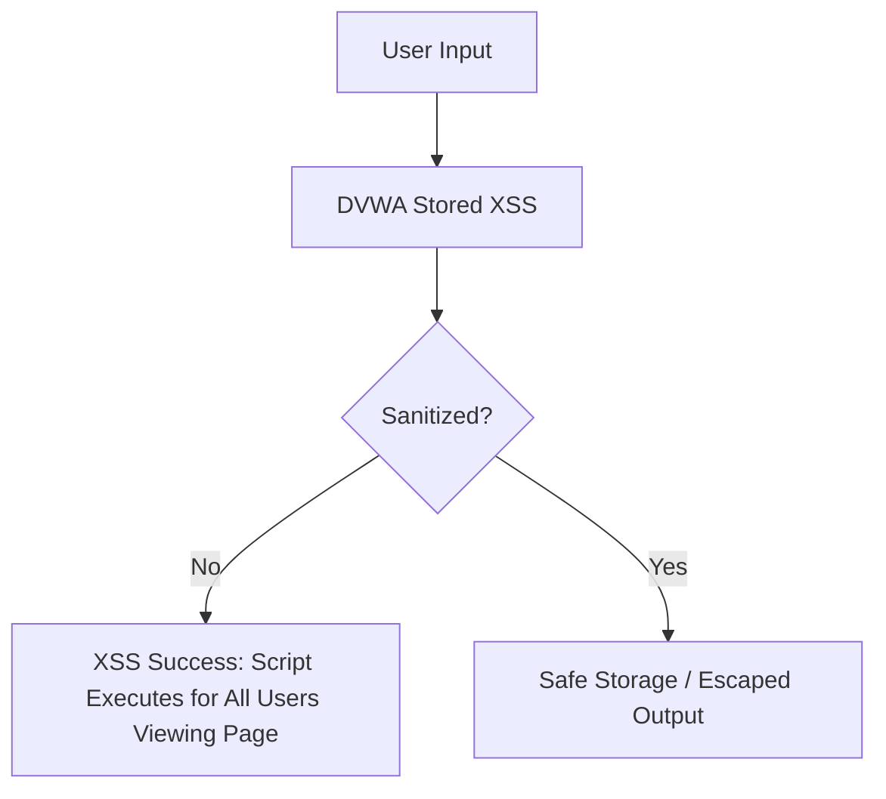

# Stored Cross-Site Scripting (XSS) – DVWA Low Security

**Tester:** Areebah Khan  
**Application:** DVWA v1.10 – Low Security  
**Date:** 07/09/25

---

## Objective

Demonstrate Stored XSS vulnerabilities where user input is saved to the database and executed whenever the page is rendered, allowing attackers to persistently inject JavaScript.

---

## Methodology
Testing was performed on the Stored XSS (Low) page of DVWA. Input was submitted via form fields that store data (e.g., guestbook). Payloads were safely crafted to illustrate stored script execution without affecting other users outside the lab environment.

Steps followed:
1. Submit a JavaScript payload into the form.
2. Verify that the payload is stored in the database.
3. Observe execution when the page is rendered.  

---

## Exploitation Steps

 
Step 1: Inject Stored JavaScript Alert

**Payload:** 

**Observation:**
- Alert executes automatically whenever the page is viewed.
- Confirms that the application does not sanitize input before saving to the database.

**Impact:**
- Persistent execution for all users visiting the page.
- Could be used to steal cookies, hijack sessions, or perform actions on behalf of other users.

 
Step 2: Manipulate Page Appearance (Optional)

**Payload:** 

**Observation:**
- Page background changes to yellow.
- Confirms arbitrary JavaScript execution can manipulate the DOM.

**Impact:**
- Demonstrates persistent visual changes for all users.
- Can be used for phishing, UI manipulation, or persistent malicious scripts.

--- 

**Summary:**
- DVWA Low Security is vulnerable to Stored XSS.
- Exploitation path:
Inject JavaScript via form input.
Input is stored in the database.
Script executes for all users viewing the page.
- Real-world implications: session hijacking, phishing, DOM manipulation, persistent attacks.

---

**Recommendations/Mitigations:**
1. Sanitize and validate all user input before saving to the database.
2. Escape output in HTML contexts when rendering stored data.
3. Implement Content Security Policy (CSP) headers.
4. Encode special characters to prevent script execution.
5. Educate developers on secure coding and stored XSS prevention.

--- 

